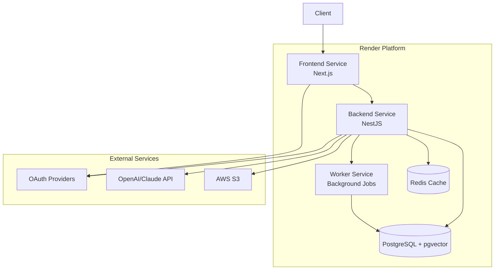

```mermaid
graph TB
    subgraph Render["Render Platform"]
        FE[Frontend Service<br/>Next.js]
        BE[Backend Service<br/>NestJS]
        W[Worker Service<br/>Background Jobs]
        DB[(PostgreSQL + pgvector)]
        REDIS[(Redis Cache)]
    end
    
    subgraph External["External Services"]
        S3[AWS S3]
        AI[OpenAI/Claude API]
        AUTH[OAuth Providers]
    end
    
    Client-->FE
    FE-->BE
    BE-->DB
    BE-->REDIS
    BE-->W
    W-->DB
    BE-->S3
    BE-->AI
    FE-->AUTH
    BE-->AUTH
```
